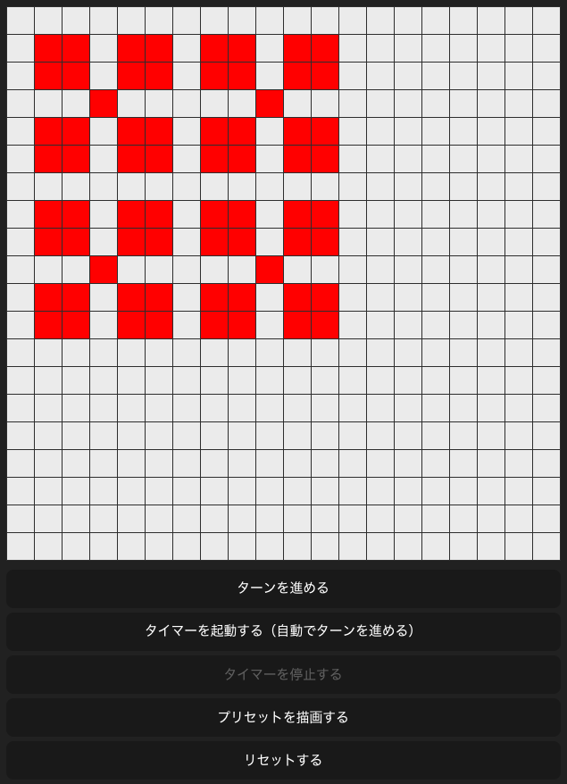

# svelte5-web-components

このリポジトリーは、技術書典17「[いまからはじめる Svelte5](https://techbookfest.org/product/4925576424980480?productVariantID=5094401858600960)」第２章のサンプルコードです。



## サンプルコードの試しかた

リポジトリーをクローンしたら、npmパッケージをインストールします。

```bash
cd svelte5-web-components
npm ci
```

そして、[Vite](https://vite.dev/)のモジュール・バンドル処理を実行し...

```bash
npm run dev
```

ウェブブラウザーで[localhost:5173](http://localhost:5173)にアクセスします。
